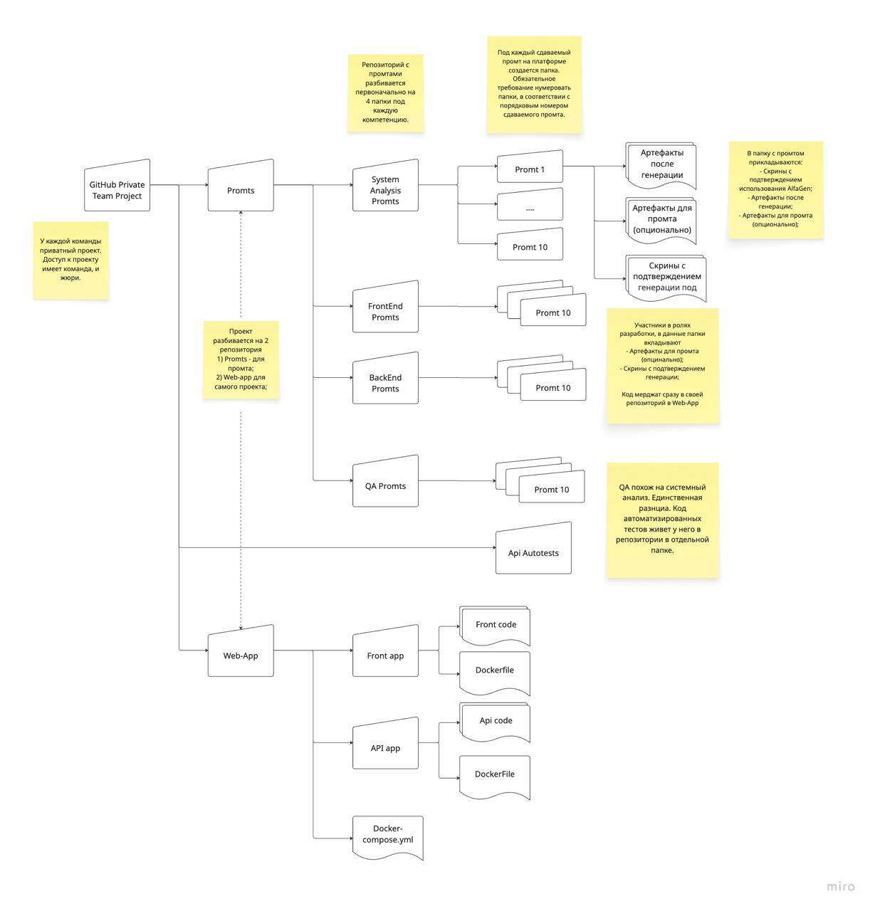

# Правила оформления репозитория
У каждой команды приватный репозиторий. Доступ к нему имеет команда и жюри. Далее представлен пример оформления репозитория с комментариями.

# Структура
Проект разбивается на 3 папки:
 - promts - для хранения артефактов, связанных с промтированием
 - webapp - сам проект, включающий себя frontend и backend, а также docker-compose.yml для поднятия приложения в контейнерах
 - autotests - проект автотестов, который был сгенерирован нейросетью

